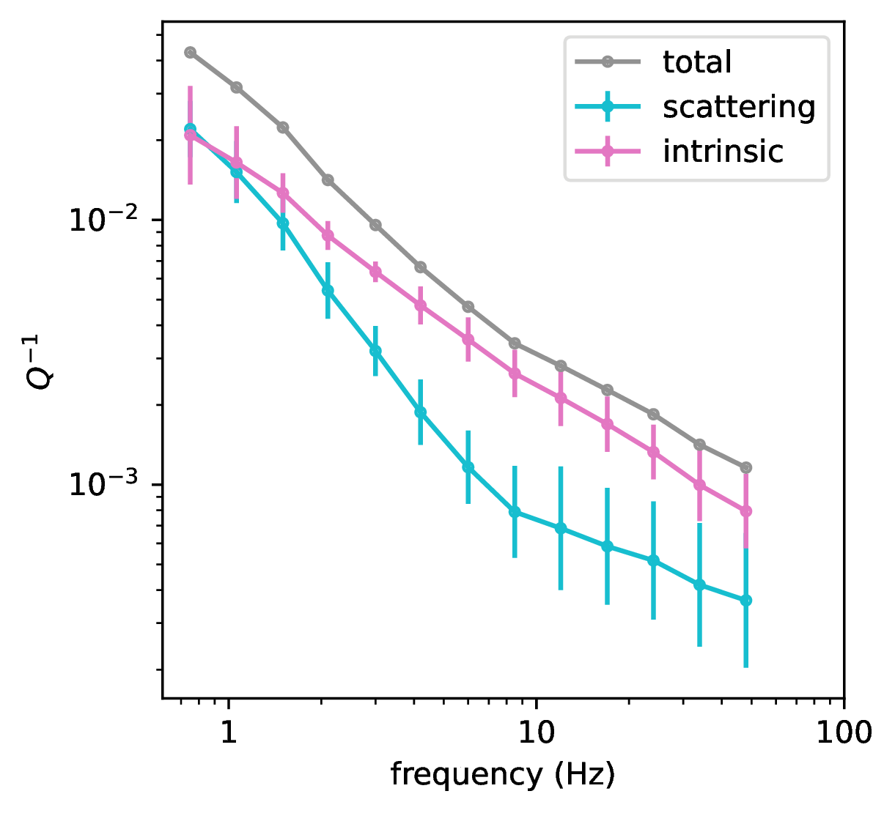
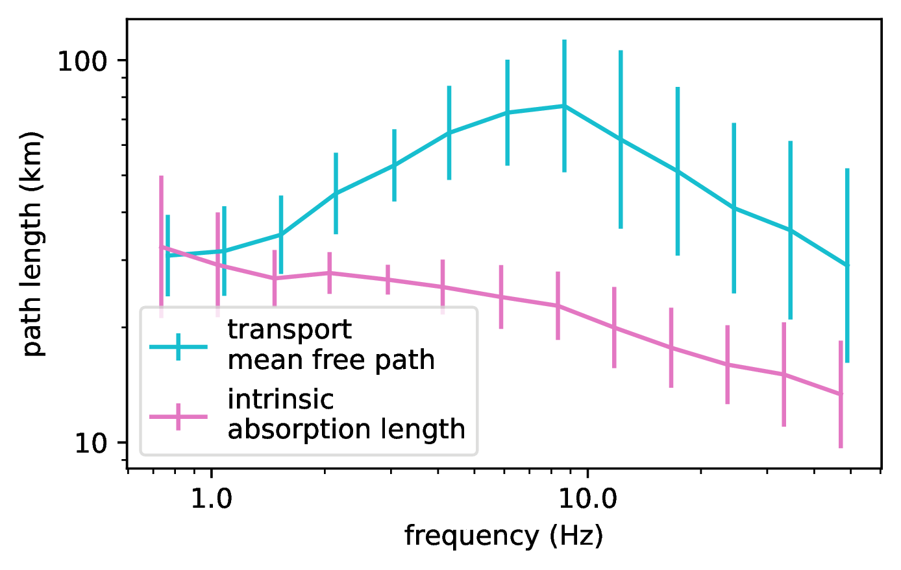
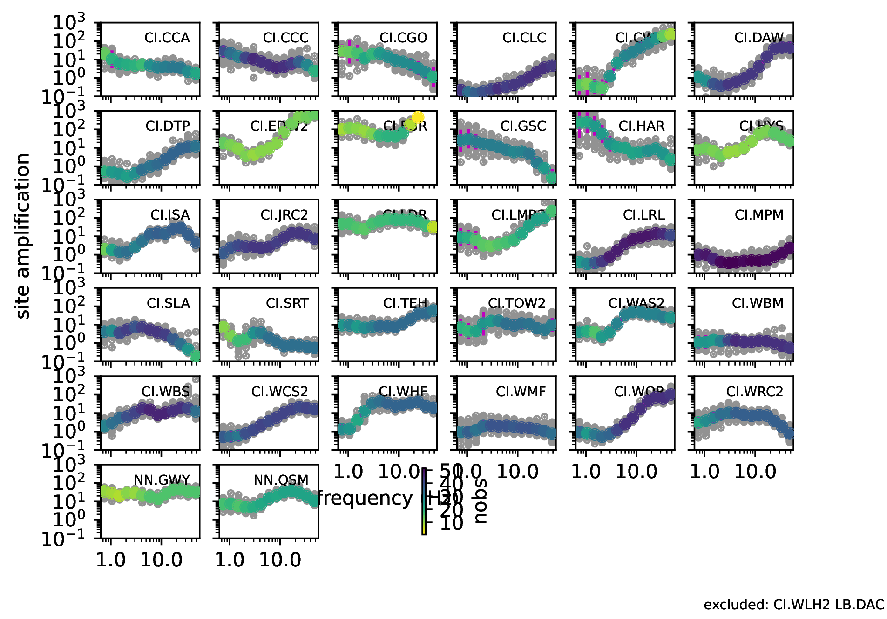
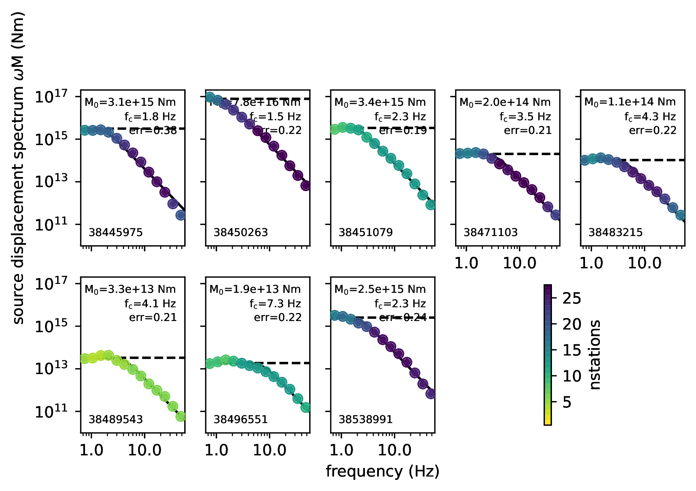
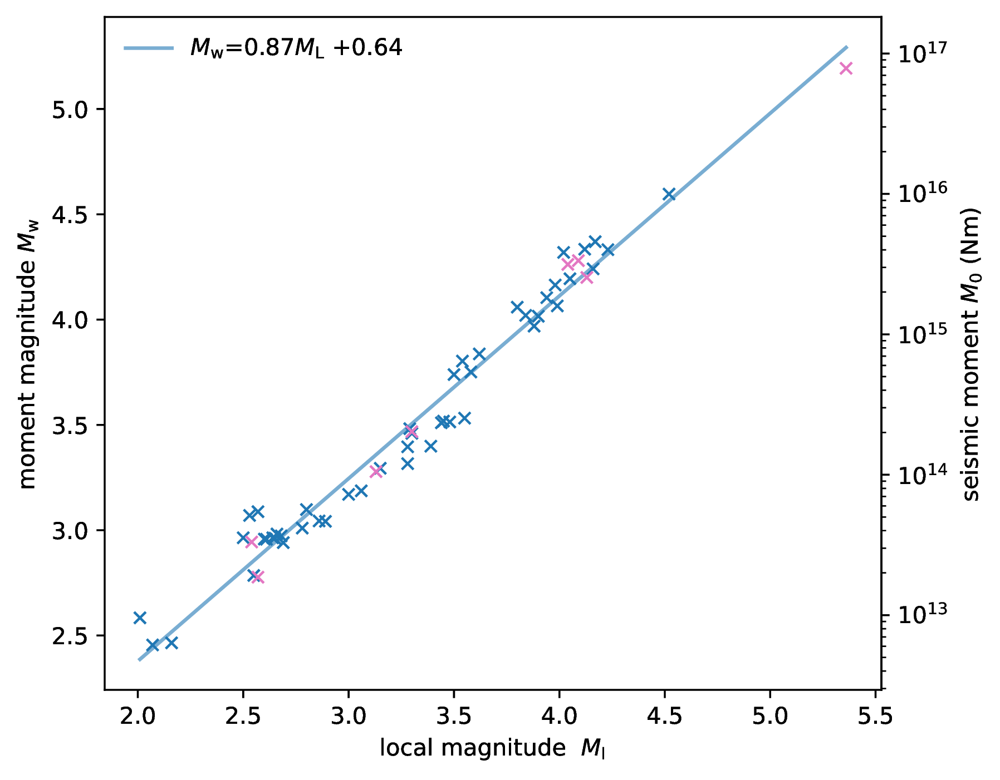
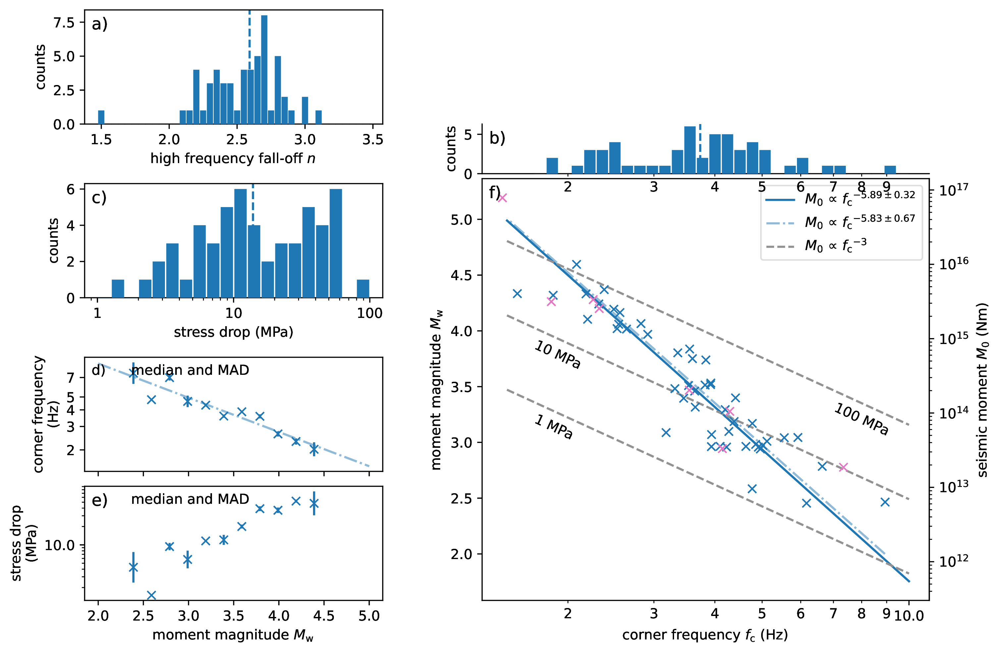

## Qopen Ridgecrest

This repository contains results and the source code to reproduce results for the
[Community Stress Drop Validation Study](https://www.scec.org/research/stress-drop-validation)
using the Qopen method.

The Qopen method fits observed seismic envelopes (energy density) of the
shear wave onset and coda with a synthetic Green’s function accounting for
scattering, intrinsic attenuation and geometrical spreading plus source and site
terms. Intrinsic attenuation and scattering
strength are estimated from the full S wave envelope and are relatively well
constrained.
The fitting is done in different frequency bands independently. Therefore
scattering, intrinsic attenuation, spectral source energy and site amplification are
obtained as a function of frequency.

References:
https://github.com/trichter/qopen#references

Robust source spectra using Qopen, BSSA,
doi:[10.1785/0120210200](https://doi.org/10.1785/0120210200)
[[pdf](https://arxiv.org/pdf/2107.11083)]

### Results

#### Attenuation




#### Site amplification
Geometric mean of site amplification of stations CI.MPM,CI.WBM,CI.WMF is fixed to 1



#### Source spectra of 8 events



#### Source spectra of 55+1 events

See [pdf](figs/sds.pdf)

#### Earthquake parameters





#### Tables

* Mw, fc, stressdrop in files `data/eqparams*.txt`.
* `_cv` -> used velocity from 2d model instead of 3200 m/s to calculate M0 from W and to calculate stress drop
* `_freen` -> optimize for M0, fc and n instead of optimization for M0, fc with fixed n=2.58

### Load source spectra or other results

```py
import json

with open ('qopen/04_source_nconst/results.json') as f:
    results = json.load(f)

freq = results['freq']
evid = '38445975'
sds = results['events'][evid]['sds']
print(freq, sds)

```

### Run code

#### Preparation

1. Prepare the code environment by installing the relevant python packages: `qopen>=4.3 obspy>=1.3.1 obspycsv>=0.4`, e.g.:

    ```
    conda --add channels conda-forge
    conda create -n eqspec obspy statsmodels
    conda activate eqspec
    pip install qopen obspycsv
    ```

2. Download the data from https://scedc.caltech.edu/data/stressdrop-ridgecrest.html.

* Unpack waveforms to events folder
* Copy StationXML to stations folder:

    ```
    cp data/events/38472279/*.xml data/stations/
    cp data/events/38472279/*.txt data/stations/
    ```

* Optionally, recreate the event CSZ files
  - Download the phase files RC_phase_*.tar, unpack these into data/phase
  - Downlaod the catalog files to data
  - Change to `scripts` folder and run `python prepare_events.py` to prepare a catalog in CSZ format readable by ObsPy```

#### Run Qopen

* Change to `qopen` folder
* Check out configuration in `conf.json`. I chose mean S wave velocity of 3200 m/s estimated from velocity model
* Run `run_qopen.sh` script to recreate results
* I have not yet done it, but the scripts can be used to invert for spectra of all ~13,000 earthquakes.
    Just repeat the last two steps (`qopen source` and `qopen recalc_source`) for the full event catalog

#### Calculate stress drops and plot figures

Change to `scripts` folder and run the remaining scripts.
